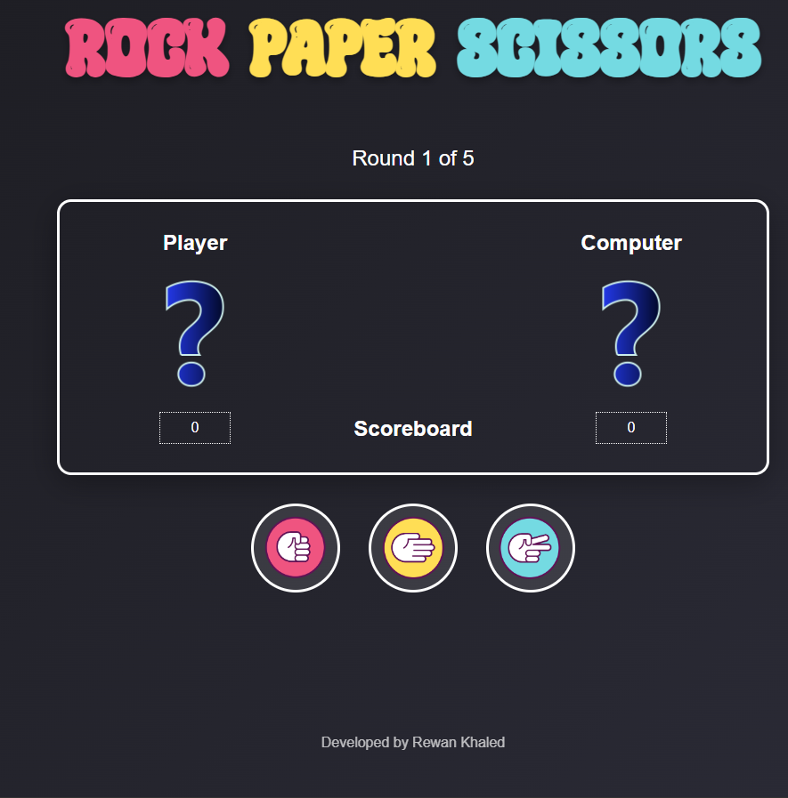

# Rock Paper Scissors Game 

A simple and fun Rock-Paper-Scissors game built using **HTML**, **CSS**, and **JavaScript**. The game is designed with a clean UI and runs directly in the browser. You play against the computer for 5 rounds, and the final result is displayed at the end.


## 🚀 How to Run

1. **Download or Clone** the repository:
```bash
git clone https://github.com/RewanAbdulkariem/rock-paper-scissors.git
```

## 🎮 How to Play
- Choose between Rock, Paper, or Scissors.
- The computer will randomly pick its choice.
- The result will be displayed, and scores updated.
- After 5 rounds, the winner is declared.
- Click the Reset button to play again.


## 📸 Screenshots
